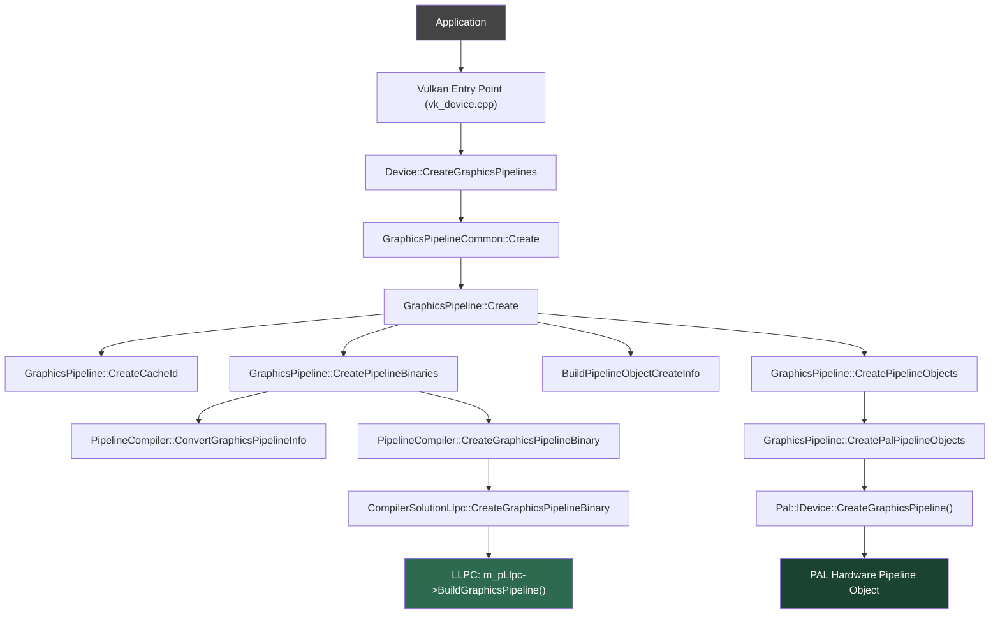
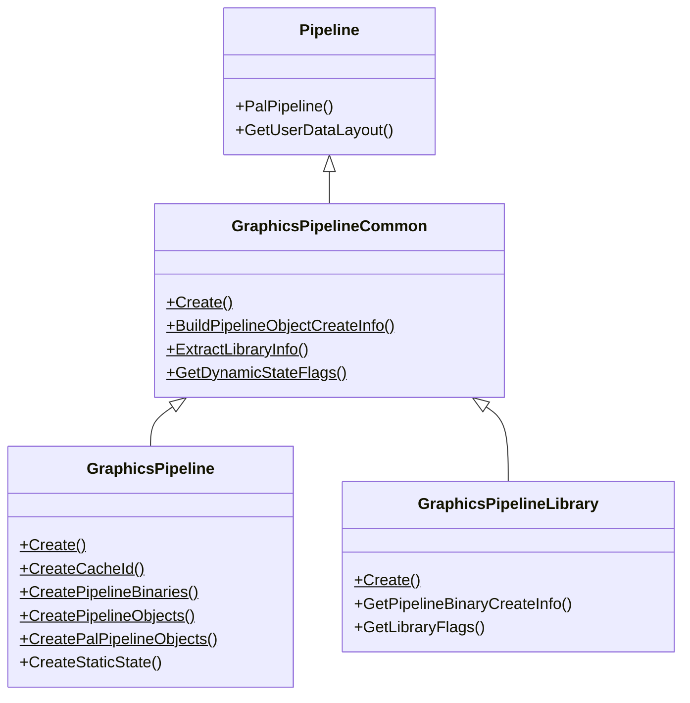

# Graphics Pipeline Creation Flow in AMDVLK Vulkan Driver

This document traces the complete code flow when an application calls `vkCreateGraphicsPipelines()`, from the Vulkan API entry point through shader compilation and down to the PAL (Platform Abstraction Layer) hardware pipeline object.

## Architecture Overview

The driver is organized in layers:



---

## Detailed Step-by-Step Flow

### Step 1 — Vulkan API Entry Point

**File:** [vk_device.cpp](file:///home/devesh/AMDVLK/vulkandriver/drivers/xgl/icd/api/vk_device.cpp#L5040-L5057)

The application calls `vkCreateGraphicsPipelines()`. The ICD dispatch table routes this to:

```cpp
// namespace entry
VKAPI_ATTR VkResult VKAPI_CALL vkCreateGraphicsPipelines(
    VkDevice device, VkPipelineCache pipelineCache,
    uint32_t createInfoCount, const VkGraphicsPipelineCreateInfo* pCreateInfos,
    const VkAllocationCallbacks* pAllocator, VkPipeline* pPipelines)
{
    Device* pDevice = ApiDevice::ObjectFromHandle(device);
    // ... resolves allocator callbacks
    return pDevice->CreateGraphicsPipelines(pipelineCache, createInfoCount, pCreateInfos, pAllocCB, pPipelines);
}
```

This simply unwraps the `VkDevice` handle into the internal `Device*` and forwards the call.

---

### Step 2 — `Device::CreateGraphicsPipelines`

**File:** [vk_device.cpp](file:///home/devesh/AMDVLK/vulkandriver/drivers/xgl/icd/api/vk_device.cpp#L2846-L2894)

Iterates over each `VkGraphicsPipelineCreateInfo` in the batch and calls `GraphicsPipelineCommon::Create()` for each one individually. Handles the `VK_PIPELINE_CREATE_EARLY_RETURN_ON_FAILURE_BIT` — if one pipeline fails, it can stop early.

**Key actions:**
- Initializes all output pipeline handles to `VK_NULL_HANDLE`
- Extracts `VkPipelineCreateFlags2KHR` via `GetPipelineCreateFlags()`
- Calls `GraphicsPipelineCommon::Create()` per pipeline

---

### Step 3 — `GraphicsPipelineCommon::Create` (Dispatch between full pipeline vs. library)

**File:** [graphics_pipeline_common.cpp](file:///home/devesh/AMDVLK/vulkandriver/drivers/xgl/icd/api/graphics_pipeline_common.cpp#L836-L892)

This is the **routing function** that decides whether to build a **full graphics pipeline** or a **Graphics Pipeline Library (GPL)**:

**Key actions:**
1. Calls `HandleExtensionStructs()` — parses the `pNext` chain to extract extension structures (e.g., `VkPipelineCreationFeedbackCreateInfoEXT`, `VkPipelineRobustnessCreateInfoEXT`, `VkGraphicsPipelineLibraryCreateInfoEXT`)
2. Handles `VkPipelineRobustnessCreateInfoEXT` at both pipeline and per-stage levels
3. **Routing decision:**
   - If `VK_PIPELINE_CREATE_LIBRARY_BIT_KHR` is set → calls `GraphicsPipelineLibrary::Create()`
   - Otherwise → calls **`GraphicsPipeline::Create()`** (the main path)

---

### Step 4 — `GraphicsPipeline::Create` (The main pipeline creation)

**File:** [vk_graphics_pipeline.cpp](file:///home/devesh/AMDVLK/vulkandriver/drivers/xgl/icd/api/vk_graphics_pipeline.cpp#L796-L1267)

This is the **core orchestration function**. It performs 6 numbered phases:

#### Phase 0: Initialize & Resource Layout
- Records the start timestamp for performance feedback
- Gets the `PipelineCompiler` for the default device
- Calls `BuildPipelineResourceLayout()` to build the user-data/descriptor layout from the `VkPipelineLayout`
- Calls `GraphicsPipelineCommon::ExtractLibraryInfo()` to determine if pre-compiled pipeline libraries are being linked in

#### Phase 1: Check GPL Fast-Link Path
- Checks if **Graphics Pipeline Library (GPL) fast-link** is possible via `IsGplFastLinkPossible()`
- If both a pre-rasterization library and a fragment shader library are available (and no link-time optimization is requested), it can skip full recompilation and instead link pre-compiled shader libraries
- Calls `PipelineCompiler::BuildGplFastLinkCreateInfo()` to prepare the fast-link

#### Phase 2: Create Cache IDs (if not fast-linking)

**Function:** [GraphicsPipeline::CreateCacheId](file:///home/devesh/AMDVLK/vulkandriver/drivers/xgl/icd/api/vk_graphics_pipeline.cpp#L1305)

- Extracts shader stage info (SPIR-V modules, entry points, specialization constants)
- Builds **shader optimizer keys** (hashes for profile matching)
- Computes a **pipeline optimizer key**
- Generates the **API PSO hash** and **ELF hash** for pipeline identification
- Computes the **cache ID** (a `MetroHash`) used to look up pre-compiled binaries

#### Phase 3: Create Pipeline Binaries (or load from cache)

**Function:** [GraphicsPipeline::CreatePipelineBinaries](file:///home/devesh/AMDVLK/vulkandriver/drivers/xgl/icd/api/vk_graphics_pipeline.cpp#L63-L323)

This is the **compilation phase**. For each PAL device:

1. **Cache lookup** — `PipelineCompiler::GetCachedPipelineBinary()` checks both the application-provided pipeline cache and the internal binary cache
2. **Convert pipeline info** — If compilation is needed, calls `PipelineCompiler::ConvertGraphicsPipelineInfo()` which translates all `VkGraphicsPipelineCreateInfo` state (vertex input, rasterization, viewport, etc.) into the LLPC `GraphicsPipelineBuildInfo` structure
3. **Compile** — Calls `PipelineCompiler::CreateGraphicsPipelineBinary()`, which:
   - Handles shader replacement (debugging feature)
   - Calls `CompilerSolutionLlpc::CreateGraphicsPipelineBinary()`, which finally calls **`m_pLlpc->BuildGraphicsPipeline()`** — the LLPC compiler entry point that compiles SPIR-V into an AMD GPU ELF binary
4. **Cache store** — Stores the compiled binary back into the cache for future reuse

#### Phase 4: Store Binaries for `VK_KHR_pipeline_binary`
- If `VK_PIPELINE_CREATE_2_CAPTURE_DATA_BIT_KHR` is set, saves binaries for later retrieval via the pipeline binary extension

#### Phase 5: Build Pipeline Object Create Info

**Function:** [GraphicsPipelineCommon::BuildPipelineObjectCreateInfo](file:///home/devesh/AMDVLK/vulkandriver/drivers/xgl/icd/api/graphics_pipeline_common.cpp#L2317)

Translates all Vulkan pipeline state into PAL structures:
- Rasterization state → `Pal::RsState`
- Color blend state → `Pal::ColorBlendStateCreateInfo`
- Depth stencil state → `Pal::DepthStencilStateCreateInfo`
- MSAA state → `Pal::MsaaStateCreateInfo`
- Viewport/scissor state
- Dynamic state tracking (which states can be changed at command buffer recording time)

#### Phase 6: Create Pipeline Objects

**Function:** [GraphicsPipeline::CreatePipelineObjects](file:///home/devesh/AMDVLK/vulkandriver/drivers/xgl/icd/api/vk_graphics_pipeline.cpp#L407-L653)

1. Allocates memory for the `GraphicsPipeline` object + PAL pipeline objects
2. Calls `GraphicsPipeline::CreatePalPipelineObjects()`:
   - For each PAL device, calls **`pPalDevice->CreateGraphicsPipeline()`** which creates the hardware-level PAL pipeline object from the compiled ELF binary
   - Handles pipeline reinjection if DevMode is active
3. Creates PAL render state objects:
   - `RenderStateCache::CreateMsaaState()` → `Pal::IMsaaState`
   - `RenderStateCache::CreateColorBlendState()` → `Pal::IColorBlendState`
   - `RenderStateCache::CreateDepthStencilState()` → `Pal::IDepthStencilState`
4. Constructs the final `GraphicsPipeline` object via **placement new**
5. Returns the `VkPipeline` handle

---

## File Summary

| Phase | Key File | Key Function |
|-------|----------|-------------|
| Entry point | [vk_device.cpp](file:///home/devesh/AMDVLK/vulkandriver/drivers/xgl/icd/api/vk_device.cpp) | `entry::vkCreateGraphicsPipelines` (L5040) |
| Batch loop | [vk_device.cpp](file:///home/devesh/AMDVLK/vulkandriver/drivers/xgl/icd/api/vk_device.cpp) | `Device::CreateGraphicsPipelines` (L2846) |
| Full vs. Library routing | [graphics_pipeline_common.cpp](file:///home/devesh/AMDVLK/vulkandriver/drivers/xgl/icd/api/graphics_pipeline_common.cpp) | `GraphicsPipelineCommon::Create` (L836) |
| Main orchestration | [vk_graphics_pipeline.cpp](file:///home/devesh/AMDVLK/vulkandriver/drivers/xgl/icd/api/vk_graphics_pipeline.cpp) | `GraphicsPipeline::Create` (L796) |
| Cache ID generation | [vk_graphics_pipeline.cpp](file:///home/devesh/AMDVLK/vulkandriver/drivers/xgl/icd/api/vk_graphics_pipeline.cpp) | `GraphicsPipeline::CreateCacheId` (L1305) |
| Binary creation/caching | [vk_graphics_pipeline.cpp](file:///home/devesh/AMDVLK/vulkandriver/drivers/xgl/icd/api/vk_graphics_pipeline.cpp) | `GraphicsPipeline::CreatePipelineBinaries` (L63) |
| VK → LLPC state conversion | [pipeline_compiler.cpp](file:///home/devesh/AMDVLK/vulkandriver/drivers/xgl/icd/api/pipeline_compiler.cpp) | `PipelineCompiler::ConvertGraphicsPipelineInfo` (L2964) |
| Compiler dispatch | [pipeline_compiler.cpp](file:///home/devesh/AMDVLK/vulkandriver/drivers/xgl/icd/api/pipeline_compiler.cpp) | `PipelineCompiler::CreateGraphicsPipelineBinary` (L1063) |
| LLPC compilation | [compiler_solution_llpc.cpp](file:///home/devesh/AMDVLK/vulkandriver/drivers/xgl/icd/api/compiler_solution_llpc.cpp) | `CompilerSolutionLlpc::CreateGraphicsPipelineBinary` (L200) |
| LLPC → ELF | (LLPC library) | `m_pLlpc->BuildGraphicsPipeline()` |
| VK → PAL state conversion | [graphics_pipeline_common.cpp](file:///home/devesh/AMDVLK/vulkandriver/drivers/xgl/icd/api/graphics_pipeline_common.cpp) | `BuildPipelineObjectCreateInfo` (L2317) |
| PAL pipeline creation | [vk_graphics_pipeline.cpp](file:///home/devesh/AMDVLK/vulkandriver/drivers/xgl/icd/api/vk_graphics_pipeline.cpp) | `GraphicsPipeline::CreatePalPipelineObjects` (L327) |
| PAL HW objects | PAL library | `Pal::IDevice::CreateGraphicsPipeline()` |
| Final VkPipeline object | [vk_graphics_pipeline.cpp](file:///home/devesh/AMDVLK/vulkandriver/drivers/xgl/icd/api/vk_graphics_pipeline.cpp) | `GraphicsPipeline::CreatePipelineObjects` (L407) |

---

## Class Hierarchy



---

## Key Data Structures

| Structure | Purpose |
|-----------|---------|
| `VkGraphicsPipelineCreateInfo` | Vulkan API input — all pipeline state |
| `GraphicsPipelineExtStructs` | Parsed extension structures from `pNext` chain |
| `GraphicsPipelineLibraryInfo` | Info about linked pipeline libraries |
| `GraphicsPipelineShaderStageInfo` | Internal representation of shader stages |
| `PipelineResourceLayout` | Descriptor set layout + user-data layout |
| `GraphicsPipelineBinaryCreateInfo` | Input to LLPC — contains `Vkgc::GraphicsPipelineBuildInfo` |
| `GraphicsPipelineObjectCreateInfo` | Input to PAL — contains `Pal::GraphicsPipelineCreateInfo` |
| `Vkgc::BinaryData` | Compiled pipeline ELF binary |
| `Pal::IPipeline` | PAL hardware pipeline object |

---

## Alternative Paths

### GPL Fast-Link Path
When pre-compiled shader libraries (from `VK_EXT_graphics_pipeline_library`) are available, the driver can skip full recompilation. Instead of phases 2+3, it:
1. Links pre-rasterization + fragment shader libraries via `BuildGplFastLinkCreateInfo()`
2. Optionally creates a color export shader library
3. Uses `ppShaderLibraries` in the PAL create info instead of a monolithic ELF binary

### Pipeline Binary Path (`VK_KHR_pipeline_binary`)
If `pPipelineBinaryInfoKHR` is provided, pre-compiled binaries are used directly, skipping cache lookup and compilation entirely.

### SQTT Layer (Shader Profiling)
When the SQTT layer is enabled, it wraps `vkCreateGraphicsPipelines()` in [sqtt_layer.cpp](file:///home/devesh/AMDVLK/vulkandriver/drivers/xgl/icd/api/sqtt/sqtt_layer.cpp#L2341) to add profiling instrumentation.
